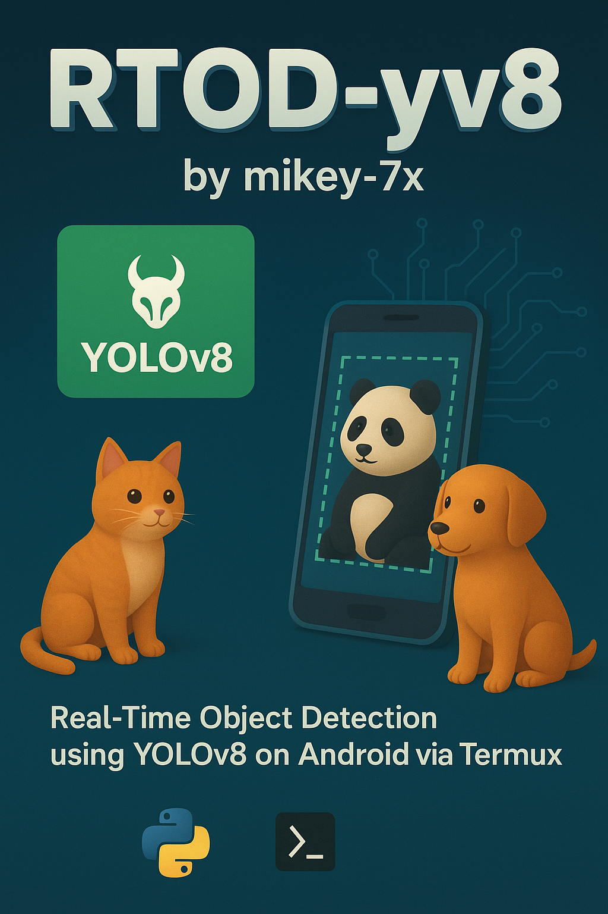

[](https://creativecommons.org/licenses/by-nc-nd/4.0/)

> - RTOD-yv8: Real-Time Object Detection using YOLOv8 on Android via Termux
> - © 2025 mikey-7x
> - Licensed under the Creative Commons Attribution-NonCommercial-NoDerivatives 4.0 International (CC BY-NC-ND 4.0)
> - This work is for educational and non-commercial purposes only.
> - Do not use, copy, or redistribute for profit. Do not claim as your own.

# ☘️RTOD-yv8

**Real-Time Object Detection using YOLOv8 (RTOD-yv8) & IP Camera on Android**  

This project enables **real-time object detection using YOLOv8** on an Android phone with an IP camera. It sets up an environment in **Linux (inside Termux)** and provides an easy-to-use interface for real-time detection and streaming via a web browser.  


## **👁️‍🗨️ Practical Implementation Video**  
Watch the real-time object detection setup and execution in action:

[](https://youtu.be/Z2IPboIIq9U)  

---

## **✨ Features**  
✔ **Automatic Installation Script**: [`yolov8.sh`](https://github.com/mikey-7x/RTOD-yv8/blob/main/yolov8.sh) (Installs all necessary dependencies)  
✔ **Real-Time Object Detection Script**: [`mikey.sh`](https://github.com/mikey-7x/RTOD-yv8/blob/main/mikey.sh) (Starts detection and live streaming)  
✔ **Flask-Based Live Streaming**: View detected objects in any web browser  
✔ **YOLOv8 Model Integration**: Uses `yolov8n.pt` for object detection  
✔ **Works on Android** via Termux & a Linux distribution  

---  

## **🚀 Setup & Installation**  

### **Step 1: Install Termux & Linux Distribution**  
1. **Download Termux** from [F-Droid](https://f-droid.org/en/packages/com.termux/).  
2. Install a Linux distribution inside Termux (**Ubuntu, Kali, etc.**) using `proot-distro` or manual installation.  
3. Start your Linux environment inside Termux.  

### **Step 2: Run the Setup Script**  
Once inside your Linux OS, open a terminal and run the following command:  

```
sudo apt install git wget
```
```
git clone https://github.com/mikey-7x/RTOD-yv8.git
```
```
cd RTOD-yv8
```
```
chmod +x *
```
```
./yolov8.sh
```

This script will:  
✔ Update & upgrade system packages  
✔ Install Python, dependencies, and necessary libraries  
✔ Set up a **virtual environment** to protect system packages  
✔ Download the YOLOv8 model (`yolov8n.pt`)  

### **Step 3: Start Object Detection**  
To begin real-time object detection, run:  
```sh
bash mikey.sh
```
OR
```sh
./mikey.sh
```
- It will **ask for your IP camera address** (which you get from the IP Webcam app on Play Store).
- make sure after typing/pasting ip address,end of ip address type "/video"

**(for example my ip is "http://10.115.163.241:8080" then past "http://10.115.163.241:8080/video")**

- After entering the IP, it will start detecting objects in real time.  

---

## **🎥 Viewing the Live Detection Output**  

Once the script is running, open your web browser and **type the following URL**:  

http://your-ip:5050/video_feed

For example, if your IP **camera stream is**:  

http://10.115.163.241:8080

Then to **view the detected output**, go to:  

http://10.115.163.241:5050/video_feed

Make sure your **IP is correct** when typing the link in the browser.  

---

## **⚡ Performance Considerations**  
- Detection speed **depends on your Android device’s hardware**.  
- **Internet speed & network latency** can impact real-time processing.  
- The **path of processing (IP Camera → Linux → Browser)** introduces some delay.  

---

## **📜 License**

© 2025 mikey-7x  

This project **RTOD-yv8 (Real-Time Object Detection using YOLOv8 on Android via Termux)**  
is licensed under the **Creative Commons Attribution-NonCommercial-NoDerivatives 4.0 International License (CC BY-NC-ND 4.0).**

- ✅ Allowed: Personal use, research, academic and learning purposes.  
- ❌ Not Allowed: Commercial use, selling, redistribution, or claiming this project as your own.  
- ❌ Not Allowed: Creating derivative works or modified distributions.  

For the full license text, see the [LICENSE](./LICENSE) file.

---

## **📜 Credits**  
Developed by **[mikey-7x](https://github.com/mikey-7x)** 🚀🔥  


[other repository](https://github.com/mikey-7x?tab=repositories)
